# BookTown Projection Registry and Certification Matrix

Status: Phase 8A audit and design artifact
Mode: Documentation only
Governing standard: Phase 8A Projection Recovery Framework
Last audited: 2026-05-31

## Certification Rule

A projection is production-ready only when it has a documented authority source, bounded rebuild path, verification query, reconciliation path where drift is possible, trigger failure ledger coverage, operational metric emission, and a runbook. Trigger-maintained projections without recovery are not production-ready.

## Classification

| Class | Definition |
|---|---|
| `fanout_projection` | One authority document materializes to one or more derived documents. |
| `aggregate_projection` | Many authority documents produce counters, summaries, or rollups. |
| `search_projection` | Search or discovery-optimized denormalized fields or collections. |
| `media_derivative_projection` | Storage or media authority produces derivative files or metadata. |
| `operational_projection` | Metrics, health, anomaly, audit, or ops dashboard summaries. |
| `compatibility_projection` | Legacy, DTO, or migration surface derived for older consumers. |

## All Projections

| Projection Name | Classification | Authority Source | Projection Collections / Fields | Maintainer | Current Consumers | Rebuild | Verify | Reconcile | Failure Ledger | Runbook | Current Status | Required Status | Missing Requirements |
|---|---|---|---|---|---|---:|---:|---:|---:|---:|---|---|---|
| quote fanout projections | `fanout_projection` | `quotes/{quoteId}` | `user_quotes`, `book_quote_projection`, `social_quote_projection` | `onQuoteProjectionWritten`, `recoverQuoteProjections` | quote APIs, social composer quote attachments, quote discovery | Yes | Yes | No | Yes | Yes | `production_ready` | `production_ready` | none |
| review fanout projections | `fanout_projection` | `reviews/{reviewId}` | `user_reviews`, `book_review_projection`, `social_review_projection` | `onBookReviewWritten`, `recoverReviewProjections` | `listBookReviews`, profile review hydration, social review surfaces | Yes | Yes | No | Yes | Yes | `production_ready` | `production_ready` | none |
| legacy user review projection | `compatibility_projection` | `books/{bookId}/reviews/{reviewId}` | `user_reviews` | `backfillUserReviewsProjection.cjs` | profile compatibility reads | Yes | No | No | No | No | `beta_ready` | `deprecated` | sunset plan or align with canonical review projection |
| book review/rating aggregate | `aggregate_projection` | `reviews`, legacy `books/*/reviews`, `books/*/ratings` | `book_stats` counters and flat fields | review trigger, `scheduledReviewAggregateReconcile`, `backfillDerivedStats` | book cards, review APIs, search ranking | Partial | Partial | Yes | Partial | No | `beta_ready` | `production_ready` | canonical-only reconcile, hot-book strategy above 10k cap, runbook, failure ledger |
| notification summary | `aggregate_projection` | `notifications/{notificationId}`, `activity_log` | `notification_summary`, `users/{uid}/meta/unread` | notification triggers, `recoverNotificationSummary` | notification feed, unread badges | Yes | Yes | Yes | Yes | Yes | `production_ready` | `production_ready` | none |
| notification search index | `search_projection` | `notifications/{id}` | `search_notifications` | `syncNotificationToSearchIndex`, `recoverSearchNotifications` | notification search/admin surfaces | Yes | Yes | Yes | Yes | Yes | `production_ready` | `production_ready` | none |
| post search feed | `search_projection` | `posts`, `post_stats` | `search_feed` | post/search triggers, `recoverSearchFeed` | social search, discovery feed search | Yes | Yes | Yes | Yes | Yes | `production_ready` | `production_ready` | none |
| search bookmark projection | `search_projection` | `users/{uid}/bookmarks`, `venue_bookmarks`, `event_bookmarks` | `search_bookmarks` | bookmark search triggers, `recoverSearchBookmarks` | search personalization/bookmark filters | Yes | Yes | Yes | Yes | Yes | `production_ready` | `production_ready` | none |
| post stats | `aggregate_projection` | likes, comments, reposts, bookmarks | `post_stats`, mirrored `posts.counters` | social triggers, `backfillDerivedStats` | feeds, social cards, search ranking | Partial | Partial | No | No | No | `not_ready` | `production_ready` | checkpointed rebuild, deterministic reconcile, failure ledger, runbook |
| post analytics | `aggregate_projection` | `activity_log` | `post_analytics` | `syncActivityToAnalytics` | analytics/admin surfaces | No | No | No | No | No | `not_ready` | `production_ready` | idempotent event ledger, rebuild from activity log, verification, runbook |
| activity log derived notifications | `fanout_projection` | social actions/posts/follows | `activity_log`, then `notifications` | activity triggers and notification trigger | notifications, analytics | No | No | No | No | No | `not_ready` | `production_ready` | replay procedure, failure ledger, runbook |
| public profile counters | `aggregate_projection` | follower docs | `public_profiles.followerCount`, `public_profiles.followingCount` | follow triggers | profile UI/search | Partial | No | No | No | No | `not_ready` | `production_ready` | bounded counter reconcile, verification, runbook |
| user stats | `aggregate_projection` | followers, following, shelves, library, attachments, profile fields | `user_stats` | backfills, cleanup jobs, recompute utilities | profile UI, admin | Partial | Partial | No | No | No | `not_ready` | `production_ready` | split by domain, checkpointing, verification, failure ledger, runbook |
| shelf display projections | `compatibility_projection` | `shelf_books` | generated shelf DTO book counts/covers; legacy shelf fields | shelf callables | shelf UI, profile shelves | Partial | Partial | No | Partial | No | `beta_ready` | `production_ready` | formal registry entry, rebuild contract, verification, runbook |
| user library books | `aggregate_projection` | `shelf_books`, `reading_progress` | `user_library_books` | aggregation triggers, `backfillDerivedStats` | library/profile/search/admin | Partial | No | No | No | No | `not_ready` | `production_ready` | non-destructive checkpointed rebuild, shadow/swap or targeted repair, verification, runbook |
| reading progress compatibility fields | `compatibility_projection` | `reading_progress` | normalized canonical fields on `reading_progress` | reader callables, `backfillReadingProgressCanonical` | reader insights, continue reading, shelf status | Yes | Partial | No | Partial | No | `beta_ready` | `production_ready` | runbook, failure ledger, scheduled verification |
| reader insight response projection | `compatibility_projection` | `reading_progress`, `reader_events` | callable DTO only | `getReaderInsights` | Home/Read continue reading | N/A | Partial | N/A | Partial | No | `beta_ready` | `production_ready` | documented verification and runbook for query/index health |
| reader manifests | `media_derivative_projection` | readable book attachment/storage object | `reader_manifests` | `getReaderManifest` / manifest service | reader bootstrap | Partial | Partial | No | Partial | No | `beta_ready` | `production_ready` | manifest rebuild job, failed-manifest ledger, runbook |
| reader EPUB indexes | `media_derivative_projection` | EPUB storage object | `reader_location_map`, `reader_spine_map`, `reader_section_graph`, `reader_stable_anchor_map`, `reader_navigation_index`, `reader_pagination_hints`, `reader_literary_coordinate_map`, `reader_passage_index`, `reader_annotation_identity_index`, `reader_literary_memory_primitives` | canonical EPUB producer through manifest service | reader runtime, quote/highlight anchoring | Partial | Partial | No | Partial | No | `beta_ready` | `production_ready` | checkpointed reprocess, verification queries, failure ledger, runbook |
| reader highlights/bookmarks | `compatibility_projection` | reader sync operations | `reader_highlights`, `reader_bookmarks` | `syncReaderOperations` | reader UI, profile/admin merge cleanup | N/A | Partial | No | Partial | No | `beta_ready` | `production_ready` | classify as authority-adjacent user data, runbook, verification, failure ledger |
| reader events | `operational_projection` | reader operations | `reader_events` | reader callables | streaks, diagnostics, analytics | N/A | Partial | No | Partial | No | `beta_ready` | `production_ready` | retention/replay policy, runbook, verification |
| reader sync idempotency | `operational_projection` | reader sync calls | `reader_sync_idempotency` | `syncReaderOperations` | replay safety | N/A | Partial | No | Partial | No | `beta_ready` | `production_ready` | retention/runbook, stuck-operation checks |
| reader audit/diagnostics | `operational_projection` | reader diagnostic calls | `reader_audit`, diagnostics collections | reader diagnostics | ops/debug | No | No | No | Partial | No | `not_ready` | `production_ready` | retention, health queries, runbook |
| attachment metadata | `media_derivative_projection` | upload intent and storage object | `attachments` processing fields/renditions | upload/finalize/derivative triggers | social composer, feed rendering, media URLs | Partial | Partial | Partial | Partial | No | `beta_ready` | `production_ready` | explicit reprocess command, failed status retry ledger, runbook |
| attachment image derivatives | `media_derivative_projection` | original image storage object | storage derivative files and `attachments.renditions` | `processAttachmentImageDerivatives` | feed/media rendering | Partial | Partial | Partial | Partial | No | `beta_ready` | `production_ready` | bounded storage scan, verification, failure ledger, runbook |
| attachment cleanup counters | `aggregate_projection` | expired attachment docs | `user_stats.attachmentStorageBytes` adjustments | `scheduledAttachmentCleanup` | user stats/admin | No | No | No | No | No | `not_ready` | `production_ready` | deterministic reconcile, failure ledger, runbook |
| cover jobs / cover derivatives | `media_derivative_projection` | books, external/user cover sources | `cover_jobs`, book cover fields, storage covers | cover job processors/backfills | catalog cards/search | Partial | Partial | No | Partial | No | `beta_ready` | `production_ready` | recovery runbook, verification, failure ledger |
| book search fields | `search_projection` | `books`, `editions` | embedded `search` fields/tokens/prefixes | `syncBookSearchIndex`, `backfillSearchFields` | book search engine | Yes | Partial | No | No | No | `beta_ready` | `production_ready` | runbook, failure ledger, verification report |
| reader authority projection | `compatibility_projection` | book/edition attachments and rights | `books.readerAuthority`, edition readability fields | materialization, `scripts/backfillReaderAuthority.ts` | search results, reader entry | Yes | Partial | No | No | No | `beta_ready` | `production_ready` | formal production rebuild, verification, failure ledger, runbook |
| compatibility readability fields | `compatibility_projection` | reader authority/readable attachment evidence | `books.downloadable`, `isEbookAvailable`, attachment pointer fields | materialization | legacy client/search DTOs | Partial | Partial | No | No | No | `beta_ready` | `deprecated` | sunset or rebuild under readerAuthority runbook |
| catalog identity projections | `compatibility_projection` | canonical ingestion/materialization | `book_identity`, `author_identity`, canonical keys | materialize book/author authority | ingestion dedupe/search | Partial | Partial | No | Partial | No | `beta_ready` | `production_ready` | recovery runbook, verification, failure ledger |
| authored author link projection | `fanout_projection` | users/public profiles/authors | `author_user_links`, authored `authors` fields | materialize authored canonical author | author catalog/profile | Partial | Partial | No | Partial | No | `beta_ready` | `production_ready` | rebuild/reconcile, runbook |
| social post render projection | `fanout_projection` | post content and attached entity snapshots | embedded `posts.renderProjection` / attachment snapshot fields | `createSocialPost` | social feed read path | No | Partial | No | Partial | No | `not_ready` | `production_ready` | post rehydration rebuild, stale entity snapshot policy, runbook |
| projected viewer state | `fanout_projection` | likes/bookmarks/reposts | embedded/projected viewer state fields when present | social callables/read path | feed optimization | No | Partial | No | Partial | No | `not_ready` | `production_ready` | define projection owner, rebuild or deprecate fallback, runbook |
| system metrics | `operational_projection` | metric events and trigger calls | `system_metrics`, `system_metrics_daily` | metrics utilities/event logger | admin dashboard, daily export | Partial | Partial | Partial | Partial | No | `beta_ready` | `production_ready` | runbook, recovery from event ledger, failure ledger |
| system events | `operational_projection` | structured app events | `system_events` | `logSystemEvent` | admin event views, analytics export | N/A | Partial | No | Partial | No | `beta_ready` | `production_ready` | retention/runbook, verification |
| analytics daily exports | `operational_projection` | `system_metrics`, `system_events` | `analytics_exports` | scheduled export | admin/reporting | No | Partial | No | Partial | No | `not_ready` | `production_ready` | rerun command per date, verification, runbook |
| operational runtime health | `operational_projection` | `recordOperationalMetric` calls | `operational_metrics`, `runtime_health_projection`, `beta_observability_summary` | operations metrics writer | operational dashboard | No | Partial | No | Partial | No | `beta_ready` | `production_ready` | rebuild/report from retained metrics, runbook |
| runtime anomaly projections | `operational_projection` | operational metrics | `runtime_anomaly_projection`, `runtime_anomaly_events` | anomaly detector | operational dashboard | No | Partial | No | Partial | No | `beta_ready` | `production_ready` | recompute/resolve workflow, runbook |
| intelligence signal queue | `operational_projection` | user activity/read/write/social signals | intelligence signal collections/queue | intelligence profile builder | admin intelligence, personalization | Partial | Partial | Partial | Partial | No | `beta_ready` | `production_ready` | projection registry/runbooks/failure ledger alignment |
| intelligence aggregates | `aggregate_projection` | intelligence signals | profile/aggregate intelligence collections | scheduled aggregation/reconciliation/audit workers | admin intelligence dashboard | Partial | Partial | Yes | Partial | No | `beta_ready` | `production_ready` | runbook, health SLO, certification checklist |
| deletion/cascade cleanup projections | `operational_projection` | deletion requests and authority docs | cascade-deleted projection docs | control delete flows | privacy/admin compliance | Partial | Partial | No | Partial | No | `beta_ready` | `production_ready` | post-delete verification runbook, failure ledger |

## Projection Dependency Map

```mermaid
flowchart TD
  Quotes["quotes"] --> QuoteProj["user_quotes / book_quote_projection / social_quote_projection"]
  Reviews["reviews"] --> ReviewProj["user_reviews / book_review_projection / social_review_projection"]
  Reviews --> BookStats["book_stats"]
  LegacyReviews["books/*/reviews + ratings"] --> BookStats
  Activity["activity_log"] --> Notifications["notifications"]
  Notifications --> NotificationSummary["notification_summary + users/*/meta/unread"]
  Notifications --> SearchNotifications["search_notifications"]
  Posts["posts"] --> SearchFeed["search_feed"]
  PostStats["post_stats"] --> SearchFeed
  SocialActions["likes / comments / reposts / bookmarks"] --> PostStats
  SocialActions --> Activity
  Bookmarks["user bookmark subcollections"] --> SearchBookmarks["search_bookmarks"]
  ShelfBooks["shelf_books"] --> UserLibrary["user_library_books"]
  ReadingProgress["reading_progress"] --> UserLibrary
  ReadingProgress --> ReaderInsights["reader insights DTO"]
  ReaderEvents["reader_events"] --> ReaderInsights
  Attachments["attachments + storage originals"] --> AttachmentDerivatives["renditions + attachment metadata"]
  Books["books / editions"] --> BookSearch["embedded search fields"]
  Books --> ReaderAuthority["books.readerAuthority"]
  EbookStorage["ebook attachments / storage"] --> ReaderManifest["reader_manifests"]
  ReaderManifest --> ReaderIndexes["reader EPUB index collections"]
  Metrics["recordOperationalMetric"] --> RuntimeHealth["operational_metrics / runtime_health_projection"]
  Metrics --> Anomalies["runtime_anomaly_projection / events"]
  SystemEvents["system_events"] --> DailyExports["analytics_exports"]
```

## Certification Matrix

| Status | Count | Projections |
|---|---:|---|
| `production_ready` | 10 | `user_quotes`, `book_quote_projection`, `social_quote_projection`, `user_reviews`, `book_review_projection`, `social_review_projection`, `notification_summary`, `search_feed`, `search_bookmarks`, `search_notifications`. |
| `beta_ready` | 25 | legacy user review projection; book review/rating aggregate; shelf display projections; reading progress compatibility fields; reader insight response projection; reader manifests; reader EPUB indexes; reader highlights/bookmarks; reader events; reader sync idempotency; attachment metadata; attachment image derivatives; cover jobs; book search fields; reader authority projection; compatibility readability fields; catalog identity projections; authored author link projection; system metrics; system events; operational runtime health; runtime anomaly projections; intelligence signal queue; intelligence aggregates; deletion/cascade cleanup projections |
| `not_ready` | 13 | post stats; post analytics; activity log derived notifications; public profile counters; user stats; user library books; reader audit/diagnostics; attachment cleanup counters; social post render projection; projected viewer state; analytics daily exports; remaining unimplemented executable registry entries |
| `deprecated` | 0 current | Recommended future deprecated status: legacy review/readability compatibility surfaces after replacement. |

## Production Ready Projections

The quote, review, notification summary, and search projection families are Phase 8A-certified production projection families:

| Projection | Certification Basis |
|---|---|
| `user_quotes` | bounded rebuild, dry-run, checkpoint support, verification, failure ledger, health update, runbook |
| `book_quote_projection` | bounded rebuild, dry-run, checkpoint support, verification, failure ledger, health update, runbook |
| `social_quote_projection` | bounded rebuild, dry-run, checkpoint support, verification, failure ledger, health update, runbook |
| `user_reviews` | bounded rebuild, dry-run, checkpoint support, verification, failure ledger, health update, runbook |
| `book_review_projection` | bounded rebuild, dry-run, checkpoint support, verification, failure ledger, health update, runbook |
| `social_review_projection` | bounded rebuild, dry-run, checkpoint support, verification, failure ledger, health update, runbook |
| `notification_summary` | bounded aggregate rebuild, dry-run, checkpoint support, verification, reconciliation, failure ledger, health update, runbook |
| `search_feed` | bounded rebuild, dry-run, checkpoint support, verification, reconciliation, stale-field drift detection, failure ledger, health update, runbook |
| `search_bookmarks` | bounded rebuild, dry-run, checkpoint support, verification, reconciliation, failure ledger, health update, runbook |
| `search_notifications` | bounded rebuild, dry-run, checkpoint support, verification, reconciliation, stale-field drift detection, failure ledger, health update, runbook |

## Beta Ready Projections

| Projection | Why Beta Ready | Production Gap |
|---|---|---|
| book review/rating aggregate | scheduled bounded reconcile exists | hot-book cap, canonical mismatch, runbook/failure ledger |
| book search fields | bounded backfill over books/editions exists | no runbook/failure ledger/verification report |
| reader authority projection | backfill script exists | needs production contract and verification |
| reader manifests/indexes | generated deterministically from storage | needs reprocess job and failure ledger |
| attachment metadata/derivatives | processing status and cleanup exist | needs explicit recovery command and verification |
| operational metrics/anomalies | dashboard projections exist | no rebuild or operator runbook |
| intelligence aggregates | scheduled workers and reconciliation exist | not aligned to Phase 8A registry/runbook |

## Not Ready Projections

| Projection | Blocking Reason |
|---|---|
| user_library_books | global destructive in-memory rebuild path |
| post_stats/user_stats/public profile counters | global or partial counter repairs only |
| social render projection/projected viewer state | embedded snapshots with no rebuild policy |
| analytics daily exports | scheduled write only, no rerun by date |

## Deprecated Projections

No projection is currently marked deprecated in code. Phase 8A should mark these as planned deprecations once replacement paths are certified:

| Projection | Replacement |
|---|---|
| legacy `books/*/reviews` to `user_reviews` projection | top-level `reviews` canonical projection rebuild |
| readability compatibility fields (`downloadable`, `isEbookAvailable`) | `readerAuthority` |
| legacy shelf display fields | `shelf_books` backed DTO projection |

## Projections Without Rebuild Path

| Projection |
|---|
| post analytics |
| activity-log-derived notifications |
| public profile counters |
| social post render projection |
| projected viewer state |
| attachment cleanup counters |
| reader audit/diagnostics |
| analytics daily exports |
| runtime health/anomaly projections |

## Projections Without Verification

| Projection |
|---|
| post analytics |
| user library books |
| social render projections |
| projected viewer state |
| attachment cleanup counters |
| analytics daily exports |
| operational runtime projections |

## Projections Without Runbooks

All audited projections except the quote, review, notification summary, and search projection families currently lack Phase 8A-compliant operator runbooks. The certified runbooks are `docs/operations/projections/QuoteProjectionRecoveryRunbook.md`, `docs/operations/projections/ReviewProjectionRecoveryRunbook.md`, `docs/operations/projections/NotificationSummaryRecoveryRunbook.md`, `docs/operations/projections/SearchFeedRecoveryRunbook.md`, `docs/operations/projections/SearchBookmarksRecoveryRunbook.md`, and `docs/operations/projections/SearchNotificationsRecoveryRunbook.md`.

## Recovery Gap Analysis

| Gap | Impact | Required Phase 8A Fix |
|---|---|---|
| Trigger-only projections | Missed events create permanent drift | Add deterministic rebuild from canonical authority |
| Partial fanout not ledged | Operators cannot see or replay partial failures | Add projection failure ledger and retry status |
| Global destructive backfills | Unsafe for production datasets | Replace with checkpointed targeted recovery |
| No verification reports | Rebuild success cannot be proven | Add pre/post verification stage |
| No runbooks | Solo operator cannot recover under incident pressure | Add runbook per projection |
| Embedded projection fields | Stale schema fields persist silently | Define replacement/purge semantics |
| Hot entity caps | High-volume books/posts can be skipped forever | Add segmented reconciliation or escalation workflow |

## Risk Scoring

Scale: 1 low, 5 critical. Total is the sum of data loss risk, projection drift risk, user-visible impact, scalability risk, and recovery complexity.

| Rank | Projection | Data Loss | Drift | User Impact | Scale | Recovery Complexity | Total |
|---:|---|---:|---:|---:|---:|---:|---:|
| 1 | notification summary | 3 | 5 | 5 | 4 | 4 | 21 |
| 2 | quote fanout projections | 3 | 5 | 5 | 4 | 4 | 21 |
| 3 | review fanout projections | 3 | 5 | 5 | 4 | 4 | 21 |
| 4 | search_feed | 2 | 5 | 5 | 5 | 4 | 21 |
| 5 | user_library_books | 4 | 4 | 5 | 5 | 3 | 21 |
| 6 | post_stats | 2 | 5 | 5 | 5 | 3 | 20 |
| 7 | reader manifests/indexes | 3 | 4 | 5 | 4 | 4 | 20 |
| 8 | attachment derivatives | 3 | 4 | 5 | 4 | 4 | 20 |
| 9 | search_bookmarks | 2 | 4 | 4 | 5 | 4 | 19 |
| 10 | search_notifications | 2 | 4 | 4 | 5 | 4 | 19 |
| 11 | social post render projection | 2 | 4 | 5 | 4 | 4 | 19 |
| 12 | book_stats | 2 | 4 | 5 | 4 | 3 | 18 |
| 13 | user_stats | 2 | 4 | 4 | 5 | 3 | 18 |
| 14 | public profile counters | 2 | 4 | 4 | 4 | 3 | 17 |
| 15 | book search fields | 2 | 3 | 5 | 4 | 3 | 17 |
| 16 | reader authority projection | 3 | 3 | 5 | 3 | 3 | 17 |
| 17 | activity-log-derived notifications | 3 | 4 | 4 | 3 | 3 | 17 |
| 18 | post analytics | 1 | 4 | 3 | 4 | 4 | 16 |
| 19 | operational runtime projections | 1 | 3 | 3 | 3 | 4 | 14 |
| 20 | analytics daily exports | 1 | 3 | 3 | 3 | 3 | 13 |

## Phase 8A Implementation Order

1. Create shared projection registry and certification gate.
2. Create shared recovery request, checkpoint, report, verification, and failure ledger schemas.
3. Implement quote fanout recovery.
4. Implement notification summary recovery and reconciliation. Completed in Phase 8A.6.
5. Implement canonical review fanout recovery. Completed in Phase 8A.5.
6. Implement `search_feed` rebuild and stale-field verification. Completed in Phase 8A.7.
7. Implement `search_bookmarks` and `search_notifications` recovery. Completed in Phase 8A.7.
8. Replace destructive `user_library_books` rebuild with checkpointed targeted recovery.
9. Split `backfillDerivedStats` into post/user/book/shelf scoped checkpointed jobs.
10. Add post stats and public profile counter reconciliation.
11. Add reader manifest/index reprocess and verification runbook.
12. Add attachment derivative reprocess and failed-status retry workflow.
13. Add social render projection rebuild or deprecate embedded snapshots.
14. Add book search field verification report and runbook.
15. Add reader authority production verification and runbook.
16. Add analytics export rerun-by-date recovery.
17. Align operational metrics/anomaly projections to registry health model.
18. Align intelligence workers with projection registry.
19. Write runbooks for every projection.
20. Run certification matrix and block production until every required projection is `production_ready`.

## Phase 8A Backlog

| ID | Work Item | Projection(s) | Acceptance Criteria |
|---|---|---|---|
| P8A-001 | Projection registry implementation | all | registry entries exist in docs and certification check |
| P8A-002 | Failure ledger design implementation | all trigger-maintained projections | failures persist with retry status and metric emission |
| P8A-003 | Quote projection rebuild | quote fanout | dry-run/write/checkpoint/verify supported |
| P8A-004 | Notification summary rebuild | notification summary | per-user and checkpointed full rebuild supported |
| P8A-005 | Review projection rebuild | review fanout | top-level `reviews` rebuilds all three surfaces |
| P8A-006 | Search projection rebuild | search feed/bookmarks/notifications | stale/missing docs verified and repairable |
| P8A-007 | User library recovery replacement | `user_library_books` | no global delete, no in-memory full scan |
| P8A-008 | Stats reconciliation split | `post_stats`, `book_stats`, `user_stats` | each stat domain checkpointed independently |
| P8A-009 | Reader manifest recovery | reader manifests/indexes | failed/stale manifests reprocessable |
| P8A-010 | Attachment derivative recovery | attachment metadata/renditions | failed derivatives retryable and verifiable |
| P8A-011 | Social render projection decision | social render/viewer state | rebuild path or deprecation decision complete |
| P8A-012 | Runbook pack | all | each projection has Phase 8A runbook fields |
| P8A-013 | Certification gate | all | production certification fails on missing recovery capability |

## Final Certification Decision

BookTown is not projection-certified for production under Phase 8A. The system is closed-beta operable for several surfaces, but every production-critical projection still needs at least one of: rebuild path, verification, failure ledger, reconciliation, or runbook.
