# BookTown Projection Registry and Certification Matrix

Status: Phase 8A audit and design artifact
Mode: Documentation only
Governing standard: Phase 8A Projection Recovery Framework
Last audited: 2026-06-01

## Certification Rule

A projection is production-ready only when it has a documented authority source, bounded rebuild path, verification query, reconciliation path where drift is possible, trigger failure ledger coverage, operational metric emission, and a runbook. Trigger-maintained projections without recovery are not production-ready.

## Classification

| Class | Definition |
|---|---|
| `fanout_projection` | One authority document materializes to one or more derived documents. |
| `aggregate_projection` | Many authority documents produce counters, summaries, or rollups. |
| `search_projection` | Search or discovery-optimized denormalized fields or collections. |
| `media_derivative_projection` | Storage or media authority produces derivative files or metadata. |
| `operational_projection` | Metrics, health, anomaly, audit, or ops dashboard summaries. |
| `compatibility_projection` | Legacy, DTO, or migration surface derived for older consumers. |

## All Projections

| Projection Name | Classification | Authority Source | Projection Collections / Fields | Maintainer | Current Consumers | Rebuild | Verify | Reconcile | Failure Ledger | Runbook | Current Status | Required Status | Missing Requirements |
|---|---|---|---|---|---|---:|---:|---:|---:|---:|---|---|---|
| quote fanout projections | `fanout_projection` | `quotes/{quoteId}` | `user_quotes`, `book_quote_projection`, `social_quote_projection` | `onQuoteProjectionWritten`, `recoverQuoteProjections` | quote APIs, social composer quote attachments, quote discovery | Yes | Yes | No | Yes | Yes | `production_ready` | `production_ready` | none |
| review fanout projections | `fanout_projection` | `reviews/{reviewId}` | `user_reviews`, `book_review_projection`, `social_review_projection` | `onBookReviewWritten`, `recoverReviewProjections` | `listBookReviews`, profile review hydration, social review surfaces | Yes | Yes | No | Yes | Yes | `production_ready` | `production_ready` | none |
| legacy user review projection | `compatibility_projection` | `books/{bookId}/reviews/{reviewId}` | `user_reviews` | legacy compatibility trigger | profile compatibility reads | Yes | Yes | Yes | Yes | Yes | `deprecated` | `deprecated` | deprecated behind canonical `reviews/{reviewId}` fanout |
| book review/rating aggregate | `aggregate_projection` | `reviews/{reviewId}` only; legacy `books/*/reviews` and `books/*/ratings` are compatibility-only | `book_stats` counters and flat fields | canonical review trigger, `recoverBookStats` | book cards, review APIs, search ranking | Yes | Yes | Yes | Yes | Yes | `production_ready` | `production_ready` | none |
| book catalog counter projection | `compatibility_projection` | `reviews/{reviewId}` only | `books.rating`, `books.ratingsCount`, `books.reviewCount`, `books.reviewsCount` | `recoverBookStats` | home discovery, recommendations, book cards, AI book context | Yes | Yes | Yes | Yes | Yes | `production_ready` | `production_ready` | none |
| notification summary | `aggregate_projection` | `notifications/{notificationId}`, `activity_log` | `notification_summary`, `users/{uid}/meta/unread` | notification triggers, `recoverNotificationSummary` | notification feed, unread badges | Yes | Yes | Yes | Yes | Yes | `production_ready` | `production_ready` | none |
| notification search index | `search_projection` | `notifications/{id}` | `search_notifications` | `syncNotificationToSearchIndex`, `recoverSearchNotifications` | notification search/admin surfaces | Yes | Yes | Yes | Yes | Yes | `production_ready` | `production_ready` | none |
| post search feed | `search_projection` | `posts`, `post_stats` | `search_feed` | post/search triggers, `recoverSearchFeed` | social search, discovery feed search | Yes | Yes | Yes | Yes | Yes | `production_ready` | `production_ready` | none |
| search bookmark projection | `search_projection` | `users/{uid}/bookmarks`, `venue_bookmarks`, `event_bookmarks` | `search_bookmarks` | bookmark search triggers, `recoverSearchBookmarks` | search personalization/bookmark filters | Yes | Yes | Yes | Yes | Yes | `production_ready` | `production_ready` | none |
| social user stats | `aggregate_projection` | `users/{targetUid}/followers/{followerUid}`, `users/{followerUid}/following/{targetUid}` | `user_stats.followers`, `user_stats.following` | follow callables/triggers, `recoverFollowGraph` | profile UI, profile stats callable, admin | Yes | Yes | Yes | Yes | Yes | `production_ready` | `production_ready` | none |
| public profile counters | `aggregate_projection` | `users/{targetUid}/followers/{followerUid}`, `users/{followerUid}/following/{targetUid}` | `public_profiles.followerCount`, `public_profiles.followingCount` | follow triggers, `recoverFollowGraph` | profile UI/search | Yes | Yes | Yes | Yes | Yes | `production_ready` | `production_ready` | none |
| post engagement stats | `aggregate_projection` | `users/{uid}/likes/{postId}`, `users/{uid}/reposts/{postId}`, `users/{uid}/bookmarks/{entityId}` where `type=post`, `posts/{postId}/comments/{commentId}` | `post_stats`, mirrored `posts.counters` | social triggers, `recoverPostEngagementStats` | feeds, social cards, search ranking | Yes | Yes | Yes | Yes | Yes | `production_ready` | `production_ready` | none |
| event stats | `aggregate_projection` | `events/{eventId}/rsvps/{userId}` | `event_stats` | event RSVP trigger, `recoverEventStats` | event stats public read surface | Yes | Yes | Yes | Yes | Yes | `production_ready` | `production_ready` | none |
| post analytics | `aggregate_projection` | `activity_log`, `post_analytics/{postId}/viewers` | `post_analytics` | `syncActivityToAnalytics`, `recoverPostAnalytics` | analytics/admin surfaces | Yes | Yes | Yes | Yes | Yes | `production_ready` | `production_ready` | none |
| activity log derived notifications | `fanout_projection` | `activity_log` | `notifications` | activity trigger, notification trigger, `recoverActivityLogNotifications` | notifications, analytics | Yes | Yes | Yes | Yes | Yes | `production_ready` | `production_ready` | none |
| library user stats | `aggregate_projection` | `user_library_books` | `user_stats.libraryBooks`, `user_stats.counters.totalBooks` | `recoverUserStatsDomains` | profile UI, admin | Yes | Yes | Yes | Yes | Yes | `production_ready` | `production_ready` | none |
| shelf user stats | `aggregate_projection` | `shelves` | `user_stats.shelvesCreated`, `user_stats.counters.totalShelves` | `recoverUserStatsDomains` | profile UI, admin | Yes | Yes | Yes | Yes | Yes | `production_ready` | `production_ready` | none |
| content user stats | `aggregate_projection` | `posts`, `reviews`, `quotes` | `user_stats.posts`, `user_stats.reviews`, `user_stats.quotes` | `recoverUserStatsDomains` | profile UI, admin, profile quality | Yes | Yes | Yes | Yes | Yes | `production_ready` | `production_ready` | none |
| writing user stats | `aggregate_projection` | `users/*/projects` | `user_stats.projects`, `user_stats.wordsWritten` | `recoverUserStatsDomains` | profile quality, admin | Yes | Yes | Yes | Yes | Yes | `production_ready` | `production_ready` | none |
| profile quality stats | `aggregate_projection` | `users`, certified domain stats | `user_stats.profileCompletionScore`, `user_stats.pcsVersion` | `recoverUserStatsDomains` | profile UI, matchmaker | Yes | Yes | Yes | Yes | Yes | `production_ready` | `production_ready` | none |
| storage user stats | `aggregate_projection` | `attachments`, storage metadata | `user_stats.storageUsageBytes`, `user_stats.attachmentStorageFiles` | `recoverUserStatsDomains` | admin, quota checks | Yes | Yes | Yes | Yes | Yes | `production_ready` | `production_ready` | none |
| user stats compatibility envelope | `compatibility_projection` | certified user stats domains plus `social_user_stats` | `user_stats` | `recoverUserStatsDomains`, domain recoveries | profile UI, admin | Yes | Yes | Yes | Yes | Yes | `deprecated` | `deprecated` | none |
| shelf display projections | `compatibility_projection` | `shelf_books` | generated shelf DTO book counts/covers; legacy shelf fields | shelf callables, `recoverTier1PublicBetaProjection` | shelf UI, profile shelves | Yes | Yes | Yes | Yes | Yes | `production_ready` | `production_ready` | none |
| user library books | `aggregate_projection` | `shelf_books`, `reading_progress` | `user_library_books` | aggregation triggers, `recoverUserLibraryBooks` | library/profile/search/admin | Yes | Yes | Yes | Yes | Yes | `production_ready` | `production_ready` | none |
| reading progress compatibility fields | `compatibility_projection` | `reading_progress` | normalized canonical fields on `reading_progress` | reader callables, `recoverTier1PublicBetaProjection` | reader insights, continue reading, shelf status | Yes | Yes | Yes | Yes | Yes | `production_ready` | `production_ready` | none |
| reader insight response projection | `compatibility_projection` | `reading_progress`, `reader_events` | callable DTO only | `getReaderInsights`, `recoverTier1PublicBetaProjection` | Home/Read continue reading | Yes | Yes | Yes | Yes | Yes | `production_ready` | `production_ready` | none |
| reader manifests | `media_derivative_projection` | readable book attachment/storage object | `reader_manifests` | `getReaderManifest` / manifest service, `recoverTier1PublicBetaProjection` | reader bootstrap | Yes | Yes | Yes | Yes | Yes | `production_ready` | `production_ready` | none |
| reader EPUB indexes | `media_derivative_projection` | EPUB storage object | `reader_location_map`, `reader_spine_map`, `reader_section_graph`, `reader_stable_anchor_map`, `reader_navigation_index`, `reader_pagination_hints`, `reader_literary_coordinate_map`, `reader_passage_index`, `reader_annotation_identity_index`, `reader_literary_memory_primitives` | canonical EPUB producer through manifest service, `recoverTier1PublicBetaProjection` | reader runtime, quote/highlight anchoring | Yes | Yes | Yes | Yes | Yes | `production_ready` | `production_ready` | none |
| reader highlights/bookmarks | `compatibility_projection` | reader sync operations | `reader_highlights`, `reader_bookmarks` | `syncReaderOperations`, `recoverTier1PublicBetaProjection` | reader UI, profile/admin merge cleanup | Yes | Yes | Yes | Yes | Yes | `production_ready` | `production_ready` | none |
| reader events | `operational_projection` | reader operations | `reader_events` | reader callables, `recoverTier1PublicBetaProjection` | streaks, diagnostics, analytics | Yes | Yes | Yes | Yes | Yes | `production_ready` | `production_ready` | none |
| reader sync idempotency | `operational_projection` | reader sync calls | `reader_sync_idempotency` | `syncReaderOperations`, `recoverTier1PublicBetaProjection` | replay safety | Yes | Yes | Yes | Yes | Yes | `production_ready` | `production_ready` | none |
| reader audit/diagnostics | `operational_projection` | `reader_events`, reader diagnostic records, reader operational logs | `reader_audit` | reader diagnostics, `recoverReaderAuditDiagnostics` | ops/debug | Yes | Yes | Yes | Yes | Yes | `production_ready` | `production_ready` | none |
| attachment metadata | `media_derivative_projection` | upload intent and storage object | `attachments` processing fields/renditions | upload/finalize/derivative triggers, `recoverTier1PublicBetaProjection` | social composer, feed rendering, media URLs | Yes | Yes | Yes | Yes | Yes | `production_ready` | `production_ready` | none |
| attachment image derivatives | `media_derivative_projection` | original image storage object | storage derivative files and `attachments.renditions` | `processAttachmentImageDerivatives`, `recoverTier1PublicBetaProjection` | feed/media rendering | Yes | Yes | Yes | Yes | Yes | `production_ready` | `production_ready` | none |
| attachment cleanup counters | `aggregate_projection` | `attachments`, attachment metadata | `user_stats.storageUsageBytes`, `user_stats.attachmentStorageFiles` | `scheduledAttachmentCleanup`, `recoverAttachmentCleanupCounters` | user stats/admin | Yes | Yes | Yes | Yes | Yes | `production_ready` | `production_ready` | none |
| cover jobs / cover derivatives | `media_derivative_projection` | books, external/user cover sources | `cover_jobs`, book cover fields, storage covers | cover job processors/backfills, `recoverTier1PublicBetaProjection` | catalog cards/search | Yes | Yes | Yes | Yes | Yes | `production_ready` | `production_ready` | none |
| book search fields | `search_projection` | `books`, `editions` | embedded `search` fields/tokens/prefixes | `syncBookSearchIndex`, `recoverTier1PublicBetaProjection` | book search engine | Yes | Yes | Yes | Yes | Yes | `production_ready` | `production_ready` | none |
| reader authority projection | `compatibility_projection` | book/edition attachments and rights | `books.readerAuthority`, edition readability fields | materialization, `recoverTier1PublicBetaProjection` | search results, reader entry | Yes | Yes | Yes | Yes | Yes | `production_ready` | `production_ready` | none |
| compatibility readability fields | `compatibility_projection` | reader authority/readable attachment evidence | `books.downloadable`, `isEbookAvailable`, attachment pointer fields | materialization | legacy client/search DTOs | Yes | Yes | Yes | Yes | Yes | `deprecated` | `deprecated` | deprecated behind `reader_authority_projection` |
| catalog identity projections | `compatibility_projection` | canonical ingestion/materialization | `book_identity`, `author_identity`, canonical keys | materialize book/author authority, `recoverTier1PublicBetaProjection` | ingestion dedupe/search | Yes | Yes | Yes | Yes | Yes | `production_ready` | `production_ready` | none |
| authored author link projection | `fanout_projection` | users/public profiles/authors | `author_user_links`, authored `authors` fields | materialize authored canonical author, `recoverTier1PublicBetaProjection` | author catalog/profile | Yes | Yes | Yes | Yes | Yes | `production_ready` | `production_ready` | none |
| social post render projection | `fanout_projection` | `posts`, `books`, `authors`, `quotes`, `shelves` | embedded `posts.renderProjection` / attachment snapshot fields | `createSocialPost`, `recoverSocialPostRenderProjection` | social feed read path | Yes | Yes | Yes | Yes | Yes | `production_ready` | `production_ready` | none |
| projected viewer state | `fanout_projection` | `users/{uid}/likes`, `users/{uid}/bookmarks`, `users/{uid}/reposts` | `users/{uid}/post_interaction_state` | social callables/read path, `recoverProjectedViewerState` | feed optimization | Yes | Yes | Yes | Yes | Yes | `production_ready` | `production_ready` | none |
| system metrics | `operational_projection` | metric events and trigger calls | `system_metrics`, `system_metrics_daily` | metrics utilities/event logger, `recoverTier1PublicBetaProjection` | admin dashboard, daily export | Yes | Yes | Yes | Yes | Yes | `production_ready` | `production_ready` | none |
| system events | `operational_projection` | structured app events | `system_events` | `logSystemEvent`, `recoverTier1PublicBetaProjection` | admin event views, analytics export | Yes | Yes | Yes | Yes | Yes | `production_ready` | `production_ready` | none |
| analytics daily exports | `operational_projection` | `system_metrics`, `system_metrics_daily`, `system_events` | `analytics_exports` | scheduled export, `recoverAnalyticsDailyExports` | admin/reporting | Yes | Yes | Yes | Yes | Yes | `production_ready` | `production_ready` | none |
| operational runtime health | `operational_projection` | `recordOperationalMetric` calls | `operational_metrics`, `runtime_health_projection`, `beta_observability_summary` | operations metrics writer, `recoverTier1PublicBetaProjection` | operational dashboard | Yes | Yes | Yes | Yes | Yes | `production_ready` | `production_ready` | none |
| runtime anomaly projections | `operational_projection` | operational metrics | `runtime_anomaly_projection`, `runtime_anomaly_events` | anomaly detector, `recoverTier1PublicBetaProjection` | operational dashboard | Yes | Yes | Yes | Yes | Yes | `production_ready` | `production_ready` | none |
| intelligence signal queue | `operational_projection` | user activity/read/write/social signals | `intelligence_signal_queue` | intelligence profile builder, `recoverTier1PublicBetaProjection` | admin intelligence, personalization | Yes | Yes | Yes | Yes | Yes | `production_ready` | `production_ready` | none |
| intelligence aggregates | `aggregate_projection` | intelligence signals | `user_intelligence_profiles`, `intelligence_aggregates_global` | scheduled aggregation/reconciliation/audit workers, `recoverTier1PublicBetaProjection` | admin intelligence dashboard | Yes | Yes | Yes | Yes | Yes | `production_ready` | `production_ready` | none |
| deletion/cascade cleanup projections | `operational_projection` | deletion requests and authority docs | cascade-deleted projection docs | control delete flows, `recoverTier1PublicBetaProjection` | privacy/admin compliance | Yes | Yes | Yes | Yes | Yes | `production_ready` | `production_ready` | none |

## Explicitly Excluded Hidden Surfaces

These surfaces were reviewed during Phase 8A.19 and are not independent production projection families.

| Surface | Classification | Covered By | Phase 8A Certification Action |
|---|---|---|---|
| `venue_stats` | `deprecated_legacy_derivative` | none | excluded; see `docs/operations/projections/VenueStatsDeprecationRunbook.md` |
| `reader_search_index` | `compatibility_sidecar` | `reader_manifests`, `reader_epub_indexes` | no independent registry entry |
| `reader_highlight_anchors` | `compatibility_sidecar` | `reader_manifests`, `reader_epub_indexes` | no independent registry entry |
| `reader_chapter_map` | `compatibility_sidecar` | `reader_manifests`, `reader_epub_indexes` | no independent registry entry |
| `reader_section_map` | `compatibility_sidecar` | `reader_manifests`, `reader_epub_indexes` | no independent registry entry |
| `reader_stable_anchors` | `compatibility_sidecar` | `reader_manifests`, `reader_epub_indexes` | no independent registry entry |

Reader sidecars are manifest compatibility pointers/default states. They do not create new authority, do not change reader behavior, and do not require independent recovery handlers.

## Projection Dependency Map

```mermaid
flowchart TD
  Quotes["quotes"] --> QuoteProj["user_quotes / book_quote_projection / social_quote_projection"]
  Reviews["reviews"] --> ReviewProj["user_reviews / book_review_projection / social_review_projection"]
  Reviews --> BookStats["book_stats"]
  RSVPs["events/*/rsvps"] --> EventStats["event_stats"]
  LegacyReviews["books/*/reviews + ratings (legacy compatibility only)"] -. excluded from certification .-> BookStats
  Activity["activity_log"] --> Notifications["notifications"]
  Notifications --> NotificationSummary["notification_summary + users/*/meta/unread"]
  Notifications --> SearchNotifications["search_notifications"]
  Posts["posts"] --> SearchFeed["search_feed"]
  PostStats["post_stats"] --> SearchFeed
  SocialActions["likes / comments / reposts / bookmarks"] --> PostStats
  SocialActions --> Activity
  Bookmarks["user bookmark subcollections"] --> SearchBookmarks["search_bookmarks"]
  ShelfBooks["shelf_books"] --> UserLibrary["user_library_books"]
  ReadingProgress["reading_progress"] --> UserLibrary
  ReadingProgress --> ReaderInsights["reader insights DTO"]
  ReaderEvents["reader_events"] --> ReaderInsights
  Attachments["attachments + storage originals"] --> AttachmentDerivatives["renditions + attachment metadata"]
  Books["books / editions"] --> BookSearch["embedded search fields"]
  Books --> ReaderAuthority["books.readerAuthority"]
  EbookStorage["ebook attachments / storage"] --> ReaderManifest["reader_manifests"]
  ReaderManifest --> ReaderIndexes["reader EPUB index collections"]
  Metrics["recordOperationalMetric"] --> RuntimeHealth["operational_metrics / runtime_health_projection"]
  Metrics --> Anomalies["runtime_anomaly_projection / events"]
  SystemEvents["system_events"] --> DailyExports["analytics_exports"]
```

## Certification Matrix

| Status | Count | Projections |
|---|---:|---|
| `production_ready` | 52 | `user_quotes`, `book_quote_projection`, `social_quote_projection`, `user_reviews`, `book_review_projection`, `social_review_projection`, `notification_summary`, `event_stats`, `search_feed`, `search_bookmarks`, `search_notifications`, `user_library_books`, `social_user_stats`, `public_profile_counters`, `post_engagement_stats`, `book_stats`, `book_catalog_counter_projection`, `library_user_stats`, `shelf_user_stats`, `content_user_stats`, `writing_user_stats`, `profile_quality_stats`, `storage_user_stats`, `activity_log_notifications`, `post_analytics`, `analytics_daily_exports`, `attachment_cleanup_counters`, `social_post_render_projection`, `projected_viewer_state`, `reader_audit_diagnostics`, `reader_authority_projection`, `reader_manifests`, `reader_epub_indexes`, `reader_sync_idempotency`, `reading_progress_compatibility_fields`, `runtime_health_projection`, `runtime_anomaly_projection`, `book_search_fields`, `deletion_cascade_cleanup_projection`, `reader_events`, `reader_highlights_bookmarks`, `reader_insights_dto`, `attachment_metadata`, `attachment_image_derivatives`, `cover_derivatives`, `catalog_identity_projection`, `authored_author_link_projection`, `shelf_display_projection`, `system_metrics`, `system_events`, `intelligence_signal_queue`, `intelligence_aggregates`. |
| `beta_ready` | 0 | none |
| `not_ready` | 0 | none |
| `deprecated` | 4 | `legacy_user_reviews_projection`, `user_stats`, `post_stats`, `compatibility_readability_fields` |

## Production Ready Projections

The quote, review, notification summary, and search projection families are Phase 8A-certified production projection families:

| Projection | Certification Basis |
|---|---|
| `user_quotes` | bounded rebuild, dry-run, checkpoint support, verification, failure ledger, health update, runbook |
| `book_quote_projection` | bounded rebuild, dry-run, checkpoint support, verification, failure ledger, health update, runbook |
| `social_quote_projection` | bounded rebuild, dry-run, checkpoint support, verification, failure ledger, health update, runbook |
| `user_reviews` | bounded rebuild, dry-run, checkpoint support, verification, failure ledger, health update, runbook |
| `book_review_projection` | bounded rebuild, dry-run, checkpoint support, verification, failure ledger, health update, runbook |
| `social_review_projection` | bounded rebuild, dry-run, checkpoint support, verification, failure ledger, health update, runbook |
| `notification_summary` | bounded aggregate rebuild, dry-run, checkpoint support, verification, reconciliation, failure ledger, health update, runbook |
| `search_feed` | bounded rebuild, dry-run, checkpoint support, verification, reconciliation, stale-field drift detection, failure ledger, health update, runbook |
| `search_bookmarks` | bounded rebuild, dry-run, checkpoint support, verification, reconciliation, failure ledger, health update, runbook |
| `search_notifications` | bounded rebuild, dry-run, checkpoint support, verification, reconciliation, stale-field drift detection, failure ledger, health update, runbook |
| `user_library_books` | bounded deterministic rebuild from `shelf_books` and `reading_progress`, dry-run, checkpoint support, verification, reconciliation, failure ledger, health update, runbook |
| `social_user_stats` | canonical follow graph schema verification, mirror repair, dry-run, checkpoint support, reconciliation, failure ledger, health update, runbook |
| `public_profile_counters` | deterministic follower/following counter recompute from follow graph authority, dry-run, checkpoint support, reconciliation, failure ledger, health update, runbook |
| `post_engagement_stats` | deterministic exact recompute from user-centric likes/reposts/bookmarks and post comments, dry-run, checkpoint support, reconciliation, failure ledger, health update, runbook |
| `event_stats` | deterministic exact recompute from event RSVP subcollections, dry-run, checkpoint support, verification, reconciliation, failure ledger, health update, runbook |
| `book_stats` | canonical reviews-only exact recompute, dry-run, checkpoint support, verification, reconciliation, failure ledger, health update, runbook |
| `book_catalog_counter_projection` | catalog compatibility counters repaired from canonical reviews without changing ranking behavior |
| `library_user_stats` | recovered from `user_library_books` into the `user_stats` compatibility envelope |
| `shelf_user_stats` | recovered from non-virtual `shelves` into the `user_stats` compatibility envelope |
| `content_user_stats` | recovered from `posts`, `reviews`, and `quotes` into the `user_stats` compatibility envelope |
| `writing_user_stats` | recovered from `users/*/projects` into the `user_stats` compatibility envelope |
| `profile_quality_stats` | profile completion score recovered from `users` and certified domain stats |
| `storage_user_stats` | attachment storage bytes/files recovered from attachment metadata |

## Beta Ready Projections

No registered projection remains `beta_ready` after Phase 8A.19.

## Not Ready Projections

No registered projection remains `not_ready` after Phase 8A.19.

## Deprecated Projections

| Projection | Replacement |
|---|---|
| `legacy_user_reviews_projection` | top-level `reviews/{reviewId}` canonical review fanout |
| `user_stats` | certified domain projections: `social_user_stats`, `library_user_stats`, `shelf_user_stats`, `content_user_stats`, `writing_user_stats`, `profile_quality_stats`, `storage_user_stats`, `attachment_cleanup_counters` |
| `post_stats` | `post_engagement_stats` for certified engagement counters; retained as compatibility projection collection |
| `compatibility_readability_fields` | `reader_authority_projection` |

## Remaining Production Certification Gaps

No executable registry entry is missing required rebuild, verification, reconciliation where applicable, failure ledger, checkpoint, structured report, health, or runbook metadata.

## Historical Recovery Gap Closure

The Phase 8A recovery gap list is closed. The executable registry reports no `beta_ready` or `not_ready` projections, no missing runbooks, and no production-ready projection with unresolved recovery gaps.

| Historical Gap | Closure State |
|---|---|
| Trigger-only projections | Closed by deterministic recovery handlers or documented deprecation/exclusion. |
| Partial fanout not ledged | Closed by projection failure ledger integration for production recovery families. |
| Global destructive backfills | Closed by checkpointed, bounded recovery handlers with hard batch limits. |
| Missing verification report coverage | Closed by structured verification reports for production recovery families. |
| Missing runbook coverage | Closed; executable registry reports zero missing runbooks. |
| Embedded projection fields | Closed by certified compatibility projection entries or explicit deprecated/excluded classifications. |
| Hot entity caps | Closed by bounded, checkpointed recovery scopes and escalation semantics in runbooks. |

## User Library Recovery Audit

Phase 8A.8 replaced the unsafe `user_library_books` production recovery dependency with `recoverUserLibraryBooks`.

| Finding | Previous Path | Risk | Replacement |
|---|---|---|---|
| destructive rebuild | `backfillDerivedStats` deleted every `user_library_books` document before rebuilding | incident recovery could erase healthy projection data and amplify partial failures | no production recovery path deletes the full projection collection |
| global scan | `backfillDerivedStats` read all `user_library_books`, all `shelf_books`, and all `reading_progress` | unbounded reads time out and do not scale to 1M+ users | checkpointed `shelf_books` then `reading_progress` pages with hard batch max `100` |
| in-memory reconstruction | global `Map<uid, Map<bookId,...>>` aggregated the full authority corpus | memory grows with dataset size | per-candidate deterministic recompute for one `{uid, bookId}` at a time |
| projection-to-projection risk | broad stats backfill coupled library projection with `user_stats` counter writes | unrelated projections could fail in the same operational run | user library recovery writes only `user_library_books` through the Phase 8A control plane |
| missing observability | failures were not written to `projection_failure_ledger` | operators could not replay or classify failures | all recovery failures write ledger records and update `projection_health` |

Current rebuild path: `recoverUserLibraryBooks` derives each projection document exclusively from `shelf_books` and `reading_progress`.

Current verification path: bounded authority candidates are compared against `user_library_books/{uid_bookId}` for missing records, stale shelf membership, stale reading state, orphan records, and authority drift.

Current reconciliation path: `report_only` records drift without mutation; write recovery repairs stale/missing records or deletes bounded orphan records. Full execution is checkpointed and restartable.

## Risk Scoring

Scale: 1 low, 5 critical. Total is the sum of data loss risk, projection drift risk, user-visible impact, scalability risk, and recovery complexity.

| Rank | Projection | Data Loss | Drift | User Impact | Scale | Recovery Complexity | Total |
|---:|---|---:|---:|---:|---:|---:|---:|
| 1 | notification summary | 3 | 5 | 5 | 4 | 4 | 21 |
| 2 | quote fanout projections | 3 | 5 | 5 | 4 | 4 | 21 |
| 3 | review fanout projections | 3 | 5 | 5 | 4 | 4 | 21 |
| 4 | search_feed | 2 | 5 | 5 | 5 | 4 | 21 |
| 5 | user_library_books | 4 | 4 | 5 | 5 | 3 | 21 |
| 6 | event_stats | 1 | 4 | 3 | 4 | 2 | 14 |
| 7 | reader manifests/indexes | 3 | 4 | 5 | 4 | 4 | 20 |
| 8 | attachment derivatives | 3 | 4 | 5 | 4 | 4 | 20 |
| 9 | search_bookmarks | 2 | 4 | 4 | 5 | 4 | 19 |
| 10 | search_notifications | 2 | 4 | 4 | 5 | 4 | 19 |
| 11 | social post render projection | 2 | 4 | 5 | 4 | 4 | 19 |
| 12 | book_stats | 2 | 4 | 5 | 4 | 3 | 18 |
| 13 | user_stats | 2 | 4 | 4 | 5 | 3 | 18 |
| 14 | public profile counters | 2 | 4 | 4 | 4 | 3 | 17 |
| 15 | book search fields | 2 | 3 | 5 | 4 | 3 | 17 |
| 16 | reader authority projection | 3 | 3 | 5 | 3 | 3 | 17 |
| 17 | activity-log-derived notifications | 3 | 4 | 4 | 3 | 3 | 17 |
| 18 | post analytics | 1 | 4 | 3 | 4 | 4 | 16 |
| 19 | operational runtime projections | 1 | 3 | 3 | 3 | 4 | 14 |
| 20 | analytics daily exports | 1 | 3 | 3 | 3 | 3 | 13 |

## Phase 8A Implementation Order

1. Create shared projection registry and certification gate.
2. Create shared recovery request, checkpoint, report, verification, and failure ledger schemas.
3. Implement quote fanout recovery.
4. Implement notification summary recovery and reconciliation. Completed in Phase 8A.6.
5. Implement canonical review fanout recovery. Completed in Phase 8A.5.
6. Implement `search_feed` rebuild and stale-field verification. Completed in Phase 8A.7.
7. Implement `search_bookmarks` and `search_notifications` recovery. Completed in Phase 8A.7.
8. Replace destructive `user_library_books` rebuild with checkpointed targeted recovery. Completed in Phase 8A.8.
9. Split `backfillDerivedStats` into post/user/book/shelf scoped checkpointed jobs.
10. Add post stats and public profile counter reconciliation.
11. Add reader manifest/index reprocess and verification runbook.
12. Add attachment derivative reprocess and failed-status retry workflow.
13. Add social render projection rebuild or deprecate embedded snapshots.
14. Add book search field verification report and runbook.
15. Add reader authority production verification and runbook.
16. Add analytics export rerun-by-date recovery.
17. Align operational metrics/anomaly projections to registry health model. Completed by Phase 8A.19.
18. Align intelligence workers with projection registry. Completed by Phase 8A.19.
19. Write runbooks for every projection. Completed by Phase 8A.19.
20. Run certification matrix and block production until every required projection is `production_ready`. Completed by Phase 8A.19.

## Phase 8A Backlog

| ID | Work Item | Projection(s) | Acceptance Criteria |
|---|---|---|---|
| P8A-001 | Projection registry implementation | all | registry entries exist in docs and certification check |
| P8A-002 | Failure ledger design implementation | all trigger-maintained projections | failures persist with retry status and metric emission |
| P8A-003 | Quote projection rebuild | quote fanout | dry-run/write/checkpoint/verify supported |
| P8A-004 | Notification summary rebuild | notification summary | per-user and checkpointed full rebuild supported |
| P8A-005 | Review projection rebuild | review fanout | top-level `reviews` rebuilds all three surfaces |
| P8A-006 | Search projection rebuild | search feed/bookmarks/notifications | stale/missing docs verified and repairable |
| P8A-007 | User library recovery replacement | `user_library_books` | Completed: no global delete, no in-memory full scan; bounded checkpointed recovery, verification, reconciliation, health, and runbook |
| P8A-008 | Stats reconciliation split | `post_stats`, `book_stats`, `user_stats` | each stat domain checkpointed independently |
| P8A-009 | Reader manifest recovery | reader manifests/indexes | failed/stale manifests reprocessable |
| P8A-010 | Attachment derivative recovery | attachment metadata/renditions | failed derivatives retryable and verifiable |
| P8A-011 | Social render projection decision | social render/viewer state | rebuild path or deprecation decision complete |
| P8A-012 | Runbook pack | all | each projection has Phase 8A runbook fields |
| P8A-013 | Certification gate | all | production certification fails on missing recovery capability |

## Final Certification Decision

BookTown projection certification is complete for Phase 8A.19 when the executable registry gate, function build, root build, event stats tests, and runbook validation pass.
